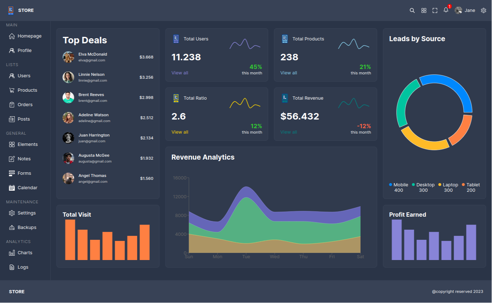
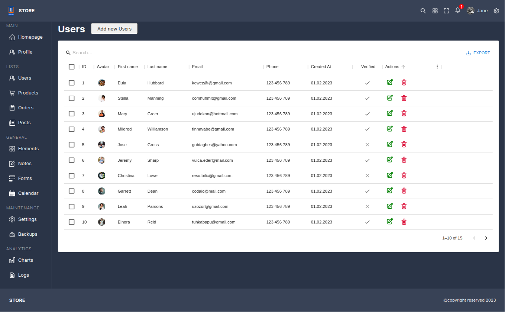
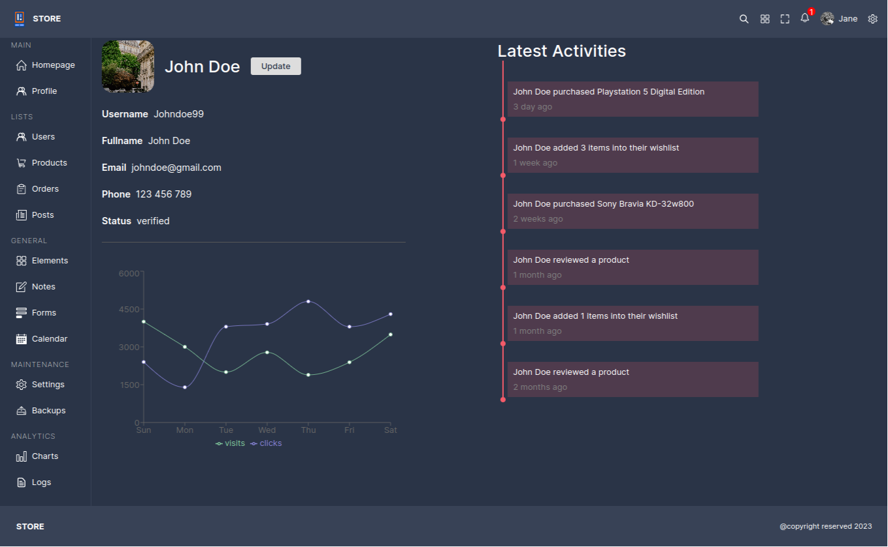
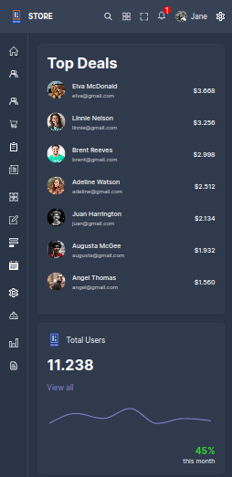
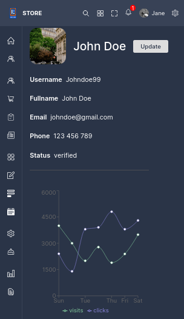

# 🔴 **React Admin Dashboard** 📊

---

## React admin dashboard create with [Rechart](https://github.com/recharts/recharts) and [MUI react-data-grid](https://github.com/mui/mui-x)

## Quick Navigation

1. [Features](#features)
2. [Screenshot](#screenshot)
   1. [Desktop](#desktop)
   2. [Mobile](#mobile)

## Features

- React dynamic routing
- Responsive Style
- Mobile First design
- Grid layout with css **Grid** and **FlexBox**
- Data display with modern charts
- MUI data-grid display

## **Screenshot**

### Desktop

|    Page    |                              Desktop                              |
| :--------: | :---------------------------------------------------------------: |
|    Home    |  |
| Users List |  |
| User Page  |  |

---

### Mobile

|   Page    |                     Mobile                      |
| :-------: | :---------------------------------------------: |
|   Home    |    |
| User Page |  |
